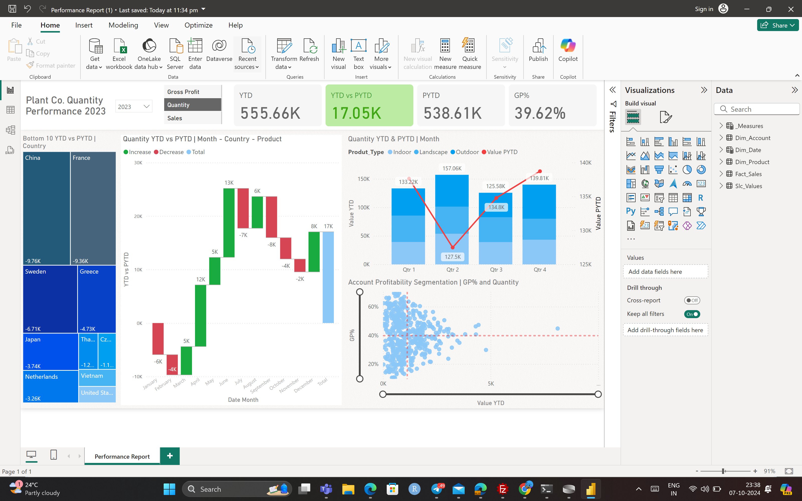

# 🌟 Dynamic Performance Reporting Dashboard for Plant Operations

An **interactive and dynamic Power BI dashboard** designed to visualize and analyze plant operations data. This dashboard empowers stakeholders to track key performance indicators (KPIs), enhance decision-making, and optimize overall plant productivity.

---

## 🚀 Features

- 📊 **Real-time Performance Insights**: Track KPIs like production efficiency, downtime, and resource utilization.
- 📈 **Advanced Visuals**: Treemap, Waterfall, Combo Charts, and Scatter plots for in-depth analysis.
- ⚙️ **Dynamic Interaction**: Drill-downs, dynamic chart titles, and slicers for personalized views.
- 📅 **Automated Data Refresh**: Seamlessly updates with the latest operational data.

---

## 📂 Project Structure

- **Dataset**: `Plant_Dataset.xlsx`
- **Dashboard**: `Plant_Performance_Dashboard.pbix`
- **Source Files**: Power BI, Power Query for data transformation, DAX for advanced calculations.

---

## 📐 Technologies Used

- **Power BI**: Data modeling, visualizations, and reporting.
- **Power Query**: Data extraction, transformation, and cleansing.
- **DAX (Data Analysis Expressions)**: Metrics calculations and insights.
- **Excel**: Data source for plant operations data.
- **Power BI Service**: Publish and share interactive dashboards.

---
